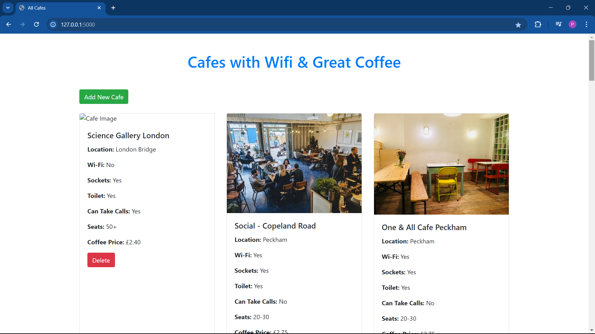
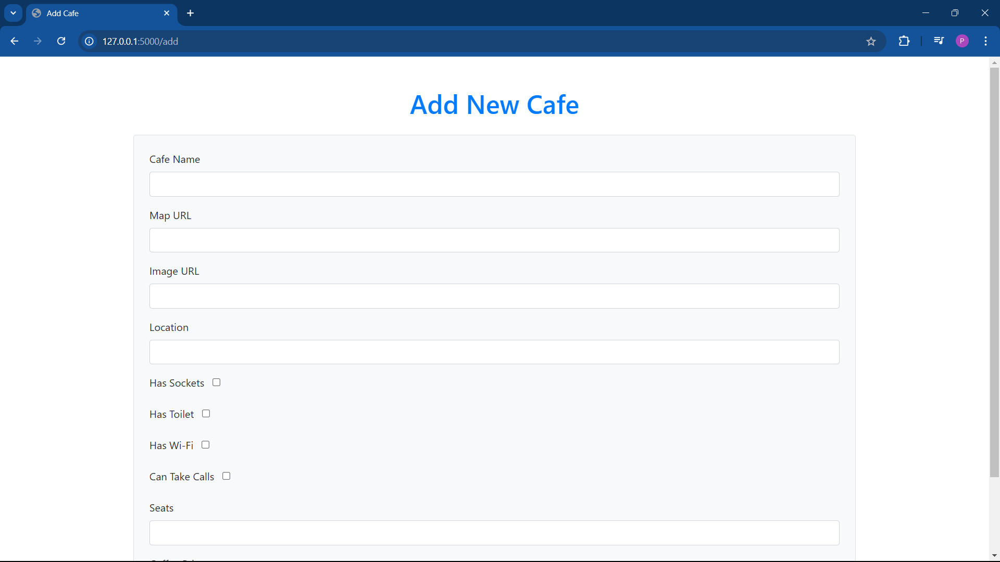

# Café and Wi-Fi Website 🌐☕️

This project is a web application built using Flask and SQLite to serve data on cafes with good Wi-Fi and coffee. Users can view a list of cafes, add new cafes, or delete existing ones. It’s a full-fledged website inspired by [LaptopFriendly](https://laptopfriendly.co/london), providing an easy way to discover cafes with strong Wi-Fi, delicious coffee, and available power sockets.

## Features 🎉

- **View Cafes**: Displays all cafes stored in the SQLite database in a card format, showing key details such as the café’s name, Wi-Fi strength, coffee rating, and more.
- **Add New Cafes**: Allows users to add new cafes by submitting details such as name, location, opening hours, and ratings.
- **Delete Cafes**: Users can delete cafes from the database with a simple button click.
- **Responsive Design**: Uses Bootstrap for a responsive, mobile-friendly interface with attractive design and easy navigation.
- **SQLite Database Integration**: The application stores all café data in an SQLite database for persistence.

## Project Structure 📂

```bash
.
├── app.py                   # Main Flask application
├── cafes.db                 # SQLite database containing cafe data
├── static/
│   ├── css/
│   │   └── styles.css        # Custom CSS for the website
│   └── img/
│       └── logo.png          # Optional logo/image assets
├── templates/
│   ├── base.html             # Base HTML template
│   ├── index.html            # Home page displaying all cafes
│   ├── add_cafe.html         # Form to add a new cafe
│   └── delete_cafe.html      # Page to delete cafes
└── README.md                 # This README file
```

## Setup and Installation 🛠️

To run this project locally, follow the steps below:

1. **Clone the repository**:
   ```bash
   git clone https://github.com/Prathamesh326/cafe-and-wifi-website.git
   cd cafe-and-wifi-website
   ```

2. **Create a virtual environment**:
   ```bash
   python -m venv venv
   ```

3. **Activate the virtual environment**:
   - On Windows:
     ```bash
     venv\Scripts\activate
     ```
   - On Mac/Linux:
     ```bash
     source venv/bin/activate
     ```

4. **Install dependencies**:
   ```bash
   pip install -r requirements.txt
   ```

5. **Run the Flask application**:
   ```bash
   flask run
   ```

6. **Access the app**:
   Open your browser and navigate to `http://127.0.0.1:5000/`.

## Database Schema 🗄️

The application uses an SQLite database (`cafes.db`) with the following structure:

- **Cafe Table**:
  - `id`: Integer (Primary Key)
  - `name`: String
  - `map_url`: String (Link to Google Maps)
  - `opening_time`: String
  - `closing_time`: String
  - `coffee_rating`: Integer (1-5)
  - `wifi_rating`: Integer (1-5)
  - `power_rating`: Integer (1-5)

## Screenshots 📸

### Home Page


### Add Café Form



## Future Improvements 🚀

- **User Authentication**: Implement user login to restrict certain actions (e.g., deleting cafes).
- **Search & Filter**: Add search functionality to filter cafes by rating or location.
- **AJAX for Dynamic Updates**: Use AJAX to refresh the list of cafes dynamically without reloading the page.
- **Review System**: Implement a review system where users can leave comments and rate cafes.

## Reflection 📔

### What was easy:
- Setting up the Flask application and configuring routes was straightforward.
- Integrating Bootstrap for a responsive design was easy, and it significantly improved the user experience.

### What was challenging:
- The initial database connection issues due to incorrect table naming.
- Ensuring that form validation and data submission worked seamlessly with SQLite and Flask.

### Learnings:
- Improved understanding of integrating a frontend (HTML, CSS) with a Flask backend.
- Handling database operations with SQLAlchemy and ensuring data is consistently reflected in the UI.

### What would I do differently next time:
- Implement more advanced features like user authentication and search functionality.
- Refactor the code to separate concerns and improve scalability.
